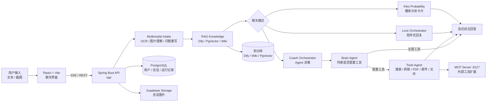

<div align="center">

# Love Master

<a href="https://github.com/DenverCoder1/readme-typing-svg">
  
</a>

**一个面向恋爱沟通场景的 AI 陪伴、分析与行动建议系统。**

Lovemaster 把多模态输入理解、RAG 知识召回、Agent 工具调用和流式聊天体验组合在一起，让用户既能获得温柔的陪伴式回复，也能得到可执行的关系沟通建议。

🌐 [简体中文](README.md) · 🌍 [English](README_EN.md)

[快速开始](#快速开始) · [核心能力](#核心能力) · [架构概览](#架构概览) · [项目结构](#项目结构) · [开发指南](#开发指南)

---

[](https://openjdk.org/)
[](https://spring.io/projects/spring-boot)
[](https://spring.io/projects/spring-ai)
[](https://react.dev/)
[](https://vite.dev/)
[](https://tailwindcss.com/)
[](https://www.postgresql.org/)
[](https://modelcontextprotocol.io/)
[](LICENSE)

</div>

<p align="center">
  
</p>

## 项目亮点

Lovemaster 不是一个只会“生成一句话回复”的聊天 Demo。它围绕恋爱沟通场景做了完整链路：用户可以上传聊天截图，系统先做 OCR 与问题重写，再结合知识库、历史会话和工具调用能力，生成更贴合语境的建议。

| 你可以用它做什么 | 系统如何支撑 |
| --- | --- |
| 和 AI 倾诉，获得自然、低压力的陪伴式回复 | Love 模式通过 SSE 返回流式回答，并结合会话上下文理解当前情绪 |
| 分析聊天截图，判断对方信号和下一步话术 | 多模态输入链路负责截图理解、OCR 提取和问题重写 |
| 让 AI 像教练一样先判断再行动 | Coach 模式由 Brain Agent 决策是否调用工具，再综合输出建议 |
| 评估“有没有戏”“成功率多高” | Kiko 概率分析输出概率、正向信号、风险信号和下一步建议 |
| 持续积累有效经验 | Wiki / Dify / PgVector 知识召回与反馈入库机制让建议逐步变准 |

## 核心能力

| 模块 | 说明 | 关键实现 |
| --- | --- | --- |
| Love Chat | 陪伴式聊天模式，适合倾诉、复盘和轻量建议 | `LoveChatOrchestrator`、SSE、聊天记忆 |
| Coach Agent | 教练式模式，先分析问题，再决定是否调用工具 | `CoachChatOrchestrator`、`BrainAgentService`、`ToolsAgentService` |
| Multimodal Intake | 处理文本与图片输入，把截图转成可推理的上下文 | OCR、截图理解、问题重写、图片存储 |
| RAG Knowledge | 从外部知识库和本地 Wiki 中召回关系建议 | Dify Dataset API、PostgreSQL / PgVector、本地 Wiki |
| Kiko Analysis | 针对成功率类问题生成结构化概率卡片 | `ProbabilityAnalysisService`、关键词意图识别 |
| Tool Ecosystem | 为 Agent 提供搜索、网页抓取、文件、PDF、邮件等能力 | Spring AI Tools、独立 MCP Server |
| Auth & Storage | 支持用户认证、会话持久化和图片云存储 | JWT、Google OAuth、Supabase Storage |
| Background Runs | 支持后台运行状态恢复，减少长任务中断感 | `ChatRunService`、运行事件记录 |

## 架构概览



### 聊天链路

| 模式 | 入口 | 处理流程 | 输出形态 |
| --- | --- | --- | --- |
| Love | `/api/ai/love_app/chat/sse` | 输入理解 -> RAG 召回 -> 陪伴式回答 | 流式文本 |
| Coach | `/api/ai/manus/chat` | 输入理解 -> RAG -> Brain 决策 -> 工具调用或直接回答 | 流式建议 |
| Kiko | 概率类意图自动触发 | 关键词识别 -> 信号聚合 -> 概率分析 | 概率卡片 |

## 技术栈

| 层级 | 技术 |
| --- | --- |
| 后端 | Java 21、Spring Boot 3.4.5、Spring AI、Spring Security、Spring Data JPA、Knife4j |
| AI / Agent | DashScope、NVIDIA NIM OpenAI-compatible API、Spring AI Tools、MCP Client |
| 知识库 | Dify Dataset API、PostgreSQL、PgVector、本地 Wiki、Caffeine Cache |
| 存储与认证 | JWT、Google OAuth、Supabase Storage |
| 前端 | React 19、Vite 7、Tailwind CSS 4、Framer Motion、Three.js、Axios |
| MCP Server | Spring Boot 3.5.0、Spring AI MCP Server WebMVC |
| 工程化 | Maven、ESLint、OpenSpec、JUnit 5 |

## 快速开始

### 环境要求

| 依赖 | 版本 |
| --- | --- |
| Java | 21+ |
| Maven | 3.6+ |
| PostgreSQL | 12+ |
| Node.js | 18+ |

### 1. 准备本地配置

所有密钥都应放在 `src/main/resources/application-local.yml` 或环境变量里，不要提交到仓库。

```powershell
Copy-Item src/main/resources/application-local.yml.example src/main/resources/application-local.yml
```

至少需要配置数据库和一个可用的模型服务：

```yaml
spring:
  datasource:
    url: jdbc:postgresql://localhost:5432/springai
    username: your_db_username
    password: your_db_password
  ai:
    dashscope:
      api-key: your_dashscope_api_key
    openai:
      api-key: your_nvidia_api_key
      base-url: https://integrate.api.nvidia.com
```

更完整的 Dify、Supabase、Google OAuth、搜索 API 配置见 [docs/QUICKSTART.md](docs/QUICKSTART.md)。

### 2. 启动后端

```powershell
mvn spring-boot:run -Dspring-boot.run.profiles=local
```

默认地址：

| 服务 | 地址 |
| --- | --- |
| API | `http://localhost:8088/api` |
| Health | `http://localhost:8088/api/health` |
| Swagger / Knife4j | `http://localhost:8088/api/swagger-ui.html` |

### 3. 启动 React 前端

```powershell
Set-Location springai-front-react
npm install
npm run dev
```

前端默认运行在 `http://localhost:5173`，并将 `/api` 代理到 `http://localhost:8088`。

### 4. 启动 MCP Server（可选）

```powershell
Set-Location mcp-servers
mvn spring-boot:run -Dspring-boot.run.profiles=local
```

MCP Server 默认运行在 `http://localhost:8127`。如果只体验基础聊天，可以先不单独启动它；主应用也提供 MCP 自动启动相关配置。

## 常用配置

| 配置项 | 用途 |
| --- | --- |
| `DB_POOLER_URL` / `DB_URL` | PostgreSQL 连接地址，使用 Supabase 时优先配置 Session Pooler |
| `DASHSCOPE_API_KEY` | DashScope 模型调用 |
| `NVIDIA_API_KEY` / `NVIDIA_BASE_URL` | NVIDIA NIM OpenAI-compatible 模型调用 |
| `DIFY_DATASET_KEY` / `DIFY_DATASET_ID` | Dify 知识库检索 |
| `SUPABASE_URL` / `SUPABASE_SERVICE_ROLE_KEY` | 会话图片云存储 |
| `GOOGLE_CLIENT_ID` | Google OAuth 登录 |
| `SEARCH_API_KEY` | WebSearchTool 网络搜索 |
| `PEXELS_API_KEY` | ImageSearchTool 图片搜索 |
| `APP_FILE_SAVE_DIR` | 主程序与 MCP Server 共享文件目录 |

## 项目结构

```text
Lovemaster/
├── src/                         # Spring Boot 后端
│   ├── main/java/org/example/springai_learn/
│   │   ├── ai/                  # Intake / RAG / Agent / Orchestrator
│   │   ├── auth/                # 用户、JWT、Google OAuth、图片存储
│   │   ├── controller/          # REST API 与 SSE 入口
│   │   ├── mcp/                 # MCP 自动启动与客户端支持
│   │   └── tools/               # Spring AI 工具实现与注册
│   └── main/resources/          # 配置、迁移脚本、MCP 配置
├── mcp-servers/                 # 独立 Spring Boot MCP Server
├── springai-front-react/        # React + Vite 前端
│   └── src/
│       ├── components/          # Chat、Sidebar、Auth、UI 组件
│       ├── contexts/            # 认证与聊天运行时上下文
│       ├── hooks/               # SSE、会话、图片上传等 Hooks
│       ├── pages/               # Home、Chat、Auth、Admin
│       └── services/            # API 客户端
├── docs/                        # 快速开始、工作流、ADR 与展示文档
├── knowledge/                   # 本地 Wiki 知识库
└── scripts/                     # Wiki 更新、接口测试等脚本
```

## 开发指南

### 常用命令

| 场景 | 命令 |
| --- | --- |
| 后端测试 | `mvn test` |
| 后端打包 | `mvn -DskipTests=true package` |
| React Lint | `cd springai-front-react && npm run lint` |
| React Build | `cd springai-front-react && npm run build` |
| MCP Server 测试 | `cd mcp-servers && mvn test` |

### 推荐开发入口

| 你要改什么 | 优先看哪里 |
| --- | --- |
| 聊天接口 | `src/main/java/org/example/springai_learn/controller/AiController.java` |
| Love / Coach 行为 | `src/main/java/org/example/springai_learn/ai/orchestrator/` |
| Agent 决策与工具调用 | `src/main/java/org/example/springai_learn/ai/service/BrainAgentService.java`、`ToolsAgentService.java` |
| 新增本地工具 | `src/main/java/org/example/springai_learn/tools/` 和 `ToolRegistration.java` |
| 概率分析卡片 | `ProbabilityAnalysisService.java` 与前端 `ProbabilityCard.jsx` |
| React 聊天体验 | `springai-front-react/src/components/Chat/` 和 `src/hooks/` |
| 知识库与自动入库 | `RagKnowledgeService.java`、`WikiKnowledgeService.java`、`KnowledgeFeedbackService.java` |

更完整的工程工作流见 [docs/WORKFLOW_GUIDE.md](docs/WORKFLOW_GUIDE.md)。

## 文档索引

| 文档 | 说明 |
| --- | --- |
| [docs/QUICKSTART.md](docs/QUICKSTART.md) | 本地启动与常见配置 |
| [docs/WORKFLOW_GUIDE.md](docs/WORKFLOW_GUIDE.md) | 开发、验证与交付流程 |
| [docs/adr](docs/adr) | 技术选型决策记录 |
| [docs/showcases](docs/showcases) | 功能展示与可视化说明 |
| [README_EN.md](README_EN.md) | 英文版 README |

## 贡献

欢迎提交 Issue 或 Pull Request。建议在提交前至少运行：

```powershell
mvn test
mvn -DskipTests=true package
Set-Location springai-front-react
npm run lint
npm run build
```

请保持改动聚焦，不要提交 `application-local.yml`、API Key、服务角色密钥或本地生成文件。

## README 设计参考

本 README 的结构参考了以下公开资料与优秀项目实践：

- [GitHub Docs: About READMEs](https://docs.github.com/en/enterprise-cloud@latest/repositories/managing-your-repositorys-settings-and-features/customizing-your-repository/about-readmes) - README 应帮助访问者快速理解项目、使用方式和维护信息。
- [matiassingers/awesome-readme](https://github.com/matiassingers/awesome-readme) - 优秀 README 示例集合，强调清晰结构、截图、安装说明和贡献入口。
- [othneildrew/Best-README-Template](https://github.com/othneildrew/Best-README-Template) - 常见 README 区块组织方式参考。
- [DenverCoder1/readme-typing-svg](https://github.com/DenverCoder1/readme-typing-svg) - 顶部打字机 SVG 动效来源。

## 开源协议

本项目基于 [MIT License](LICENSE) 开源。

<div align="center">

---

如果这个项目对你有帮助，欢迎 Star 支持。

Made with Love Master

</div>
