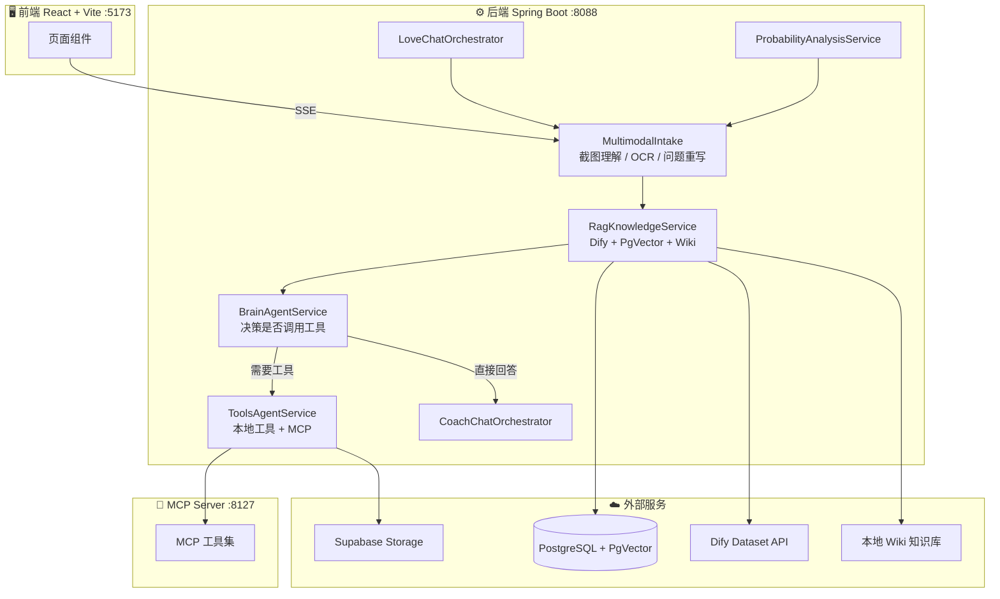

<div align="center">

# 💕 Love Master

### 你的恋爱 AI 小助手

基于 Spring AI + React 的全栈 AI 恋爱陪伴与教练应用

[English](./README_EN.md) · [快速开始](#-快速开始) · [功能亮点](#-功能亮点) · [架构设计](#-架构概览)

---

[](https://openjdk.org/)
[](https://spring.io/projects/spring-boot)
[](https://spring.io/projects/spring-ai)
[](https://react.dev/)
[](https://vitejs.dev/)
[](https://tailwindcss.com/)
[](https://www.postgresql.org/)
[](https://supabase.com/)
[](LICENSE)

</div>

<br/>

<p align="center">
  
</p>

<br/>

## ✨ 功能亮点

<table>
<tr>
<td width="50%">

### 💬 恋爱陪伴 · Love 模式

纯聊天模式，温柔地陪你聊天，不评判、不催促、只倾听。

- 支持文本与截图输入
- 智能截图理解：OCR 提取 + 问题重写
- 自动补充上下文，精准理解你的困惑

</td>
<td width="50%">

### 🧠 恋爱教练 · Coach 模式

AI Agent 架构，先思考后行动，给你最懂人心的专业建议。

- 按需调用工具：邮件、搜索、网页抓取、PDF 生成等 **10+ 工具**
- MCP Server 扩展：独立模块，动态注册外部工具
- 分析聊天记录，给你贴心且恰到好处的回复建议

</td>
</tr>
<tr>
<td width="50%">

### 🎯 Kiko AI · 概率分析

恋爱成功概率评估，让你心里有底。

- 检测到"成功率""有没有戏"等意图自动触发
- 输出结构化概率卡片：概率值 + 正面/风险信号
- 下一步行动建议，助你步步为"赢"

</td>
<td width="50%">

### 📚 知识与记忆

懂得越多，建议越准。

- RAG 检索增强（PostgreSQL + PgVector / Dify / 本地 Wiki）
- 用户反馈驱动全自动知识入库，零人工审批
- 会话持久化 + 后台运行状态恢复
- Google OAuth + JWT 认证 / Supabase 云存储

</td>
</tr>
</table>

<br/>

## 🏗 架构概览

<details open>
<summary><b>系统架构图</b></summary>

<br/>



</details>

### 聊天链路一览

| 模式 | 处理流程 | 特点 |
|:---:|:---|:---|
| **Love** | `输入 → 截图理解 → RAG 知识召回 → 陪伴式回答` | 纯聊天，直接给建议 |
| **Coach** | `输入 → 截图理解 → RAG → Brain 决策 → [直接回答 \| 工具调用] → 综合回答` | Agent 架构，先判断再行动 |
| **Kiko** | `输入 → 意图识别 → ProbabilityAnalysisService → 概率卡片` | 结构化概率分析 |

<br/>

## 🚀 快速开始

### 环境要求

| 依赖 | 最低版本 |
|:---|:---|
| Java | 21+ |
| Maven | 3.6+ |
| PostgreSQL | 12+ |
| Node.js | 18+ |

### 1️⃣ 配置

```bash
cp src/main/resources/application-local.yml.example src/main/resources/application-local.yml
# 编辑 application-local.yml，填入数据库、API Key 等配置
```

> 💡 完整配置说明见 [docs/QUICKSTART.md](docs/QUICKSTART.md)

### 2️⃣ 启动后端

```bash
mvn spring-boot:run -Dspring-boot.run.profiles=local
# API: http://localhost:8088
```

### 3️⃣ 启动前端

```bash
cd springai-front-react
npm install && npm run dev
# UI: http://localhost:5173
```

### 4️⃣ 启动 MCP Server（可选）

```bash
cd mcp-servers
mvn spring-boot:run -Dspring-boot.run.profiles=local
# MCP: http://localhost:8127
```

> 📖 详细配置（NVIDIA NIM / Dify / Supabase / Google OAuth）请参考 [docs/QUICKSTART.md](docs/QUICKSTART.md)

<br/>

## 📁 项目结构

<details>
<summary><b>点击展开完整目录</b></summary>

```
Lovemaster/
├── src/                           # Spring Boot 后端
│   └── main/java/.../
│       ├── controller/            # REST API + SSE
│       ├── ai/                    # AI 核心模块
│       │   ├── intake/            # 多模态输入处理
│       │   ├── service/           # Brain / Tools / RAG 服务
│       │   └── orchestrator/      # Love / Coach 编排器
│       ├── app/                   # LoveApp 核心
│       ├── auth/                  # 认证 + 图片存储
│       ├── tools/                 # 工具注册与实现
│       └── ChatMemory/            # 会话持久化
├── springai-front-react/          # React 前端
│   └── src/
│       ├── components/            # Chat / Sidebar / UI 组件
│       ├── pages/                 # Home / Chat / Auth
│       └── hooks/                 # 自定义 Hooks
├── mcp-servers/                   # MCP Server 模块
├── docs/                          # 详细文档
├── knowledge/                     # 本地 Wiki 知识库
└── scripts/                       # 自动化脚本
```

</details>

<br/>

## 🛠 常用命令

<details>
<summary><b>后端命令</b></summary>

```bash
mvn test                              # 运行测试
mvn -DskipTests=true package          # 打包 JAR
mvn spring-boot:run -Dspring-boot.run.profiles=local  # 启动应用
```

</details>

<details>
<summary><b>前端命令</b></summary>

```bash
cd springai-front-react
npm run dev                           # 开发模式
npm run lint                          # 代码检查
npm run build                         # 生产构建
```

</details>

<details>
<summary><b>MCP Server</b></summary>

```bash
cd mcp-servers
mvn test                              # 运行测试
mvn spring-boot:run -Dspring-boot.run.profiles=local  # 启动 MCP
```

</details>

<br/>

## 🧩 开发指南

| 场景 | 操作方式 |
|:---|:---|
| **添加新工具** | 在 `tools/` 下新建类，使用 `@Tool` 注解，在 `ToolRegistration` 中注册 |
| **调整聊天链路** | 修改 `ai/orchestrator/` 和 `ai/service/` 下对应文件 |
| **知识库更新** | `bash scripts/wiki-update.sh` 或 `bash scripts/setup-wiki-autoupdate.sh` |

> 📖 详细开发文档见 [docs/WORKFLOW_GUIDE.md](docs/WORKFLOW_GUIDE.md)

<br/>

## 🤝 参与贡献

欢迎各种形式的贡献！无论是提交 Bug、建议功能还是提交 PR，我们都非常感谢。

1. Fork 本仓库
2. 创建你的特性分支 (`git checkout -b feature/AmazingFeature`)
3. 提交改动 (`git commit -m 'Add some AmazingFeature'`)
4. Push 到分支 (`git push origin feature/AmazingFeature`)
5. 创建 Pull Request

<br/>

## 📄 开源协议

本项目基于 [MIT](LICENSE) 协议开源。

<br/>

<div align="center">

---

**如果觉得有帮助，请给个 ⭐ Star 支持一下！**

Made with ❤️ by Love Master Team

</div>
