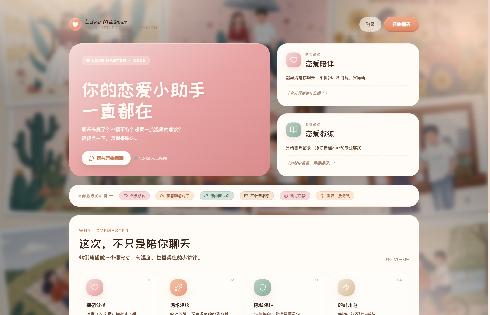
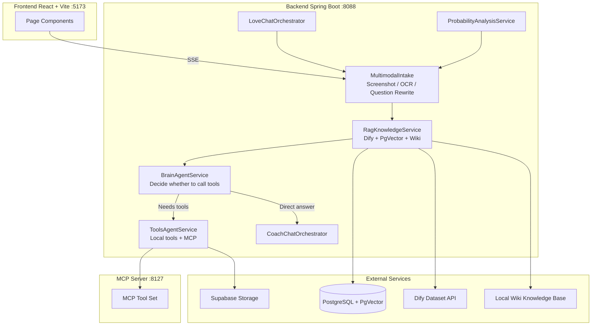

# Love Master - Your AI Dating Companion

> A full-stack AI dating companion and coaching application built with Spring AI + React

[中文](./README.md)



## Features

**Dating Companion**
- Love Mode: casual chat companion with text and screenshot input
- Smart Screenshot Understanding: OCR extraction + question rewriting with automatic context enrichment

**Dating Coach**
- Coach Mode: AI Agent architecture that thinks before acting
- Tool Calling: email, web search, web scraping, PDF generation, and 10+ tools
- MCP Server Extension: standalone module for dynamic external tool registration

**Kiko AI Probability Analysis**
- Dating success probability assessment with structured probability cards
- Positive/risk signals + next-step action recommendations

**Knowledge & Memory**
- RAG retrieval augmentation (PostgreSQL + PgVector / Dify / local Wiki)
- User feedback-driven fully automatic knowledge ingestion with zero manual approval
- Session persistence + background run state recovery

**Auth & Storage**
- Google OAuth + JWT authentication
- Supabase cloud storage for conversation images

## Tech Stack


## Architecture



## Quick Start

### Requirements

- Java 21+ / Maven 3.6+ / PostgreSQL 12+ / Node.js 18+

### 1. Configure

```bash
cp src/main/resources/application-local.yml.example src/main/resources/application-local.yml
# Edit application-local.yml with your database and API key credentials
```

> Full configuration guide: [docs/QUICKSTART.md](docs/QUICKSTART.md)

### 2. Start Backend

```bash
mvn spring-boot:run -Dspring-boot.run.profiles=local    # API: http://localhost:8088
```

### 3. Start Frontend

```bash
cd springai-front-react
npm install && npm run dev                               # UI: http://localhost:5173
```

### 4. Start MCP Server (Optional)

```bash
cd mcp-servers
mvn spring-boot:run -Dspring-boot.run.profiles=local    # MCP: http://localhost:8127
```

Detailed configuration (NVIDIA NIM / Dify / Supabase / Google OAuth): see [docs/QUICKSTART.md](docs/QUICKSTART.md).

## Project Structure

```text
Lovemaster/
├── src/                           # Spring Boot backend
│   └── main/java/.../
│       ├── controller/            # REST API + SSE
│       ├── ai/                    # Intake / Brain / Tools / Orchestrator
│       ├── app/                   # LoveApp core
│       ├── auth/                  # Auth + image storage
│       ├── tools/                 # Tool registration & implementations
│       └── ChatMemory/            # Session persistence
├── springai-front-react/          # React frontend
│   └── src/
│       ├── components/            # Chat / Sidebar / UI components
│       ├── pages/                 # Home / Chat / Auth
│       └── hooks/                 # Custom hooks
├── mcp-servers/                   # MCP Server module
├── docs/                          # Documentation
├── knowledge/                     # Local Wiki knowledge base
└── scripts/                       # Automation scripts
```

## Chat Modes

### Love Mode - Dating Companion

Pure chat mode. Gives advice directly without calling tools.

`Input → Screenshot Understanding → RAG Knowledge Recall → Companion Response`

### Coach Mode - Dating Coach

Agent architecture. Thinks first, acts second. Calls tools as needed.

`Input → Screenshot Understanding → RAG → Brain Decision → [Direct Answer | Tool Calling] → Combined Response`

### Kiko AI - Probability Analysis

Triggered when detecting intents like "success rate" or "do I have a chance". Outputs structured probability cards.

`Input → Intent Recognition → ProbabilityAnalysisService → Probability Card (Value / Signals / Suggestions)`

## Common Commands

```bash
# Backend
mvn test                              # Run tests
mvn -DskipTests=true package          # Build JAR

# Frontend
cd springai-front-react
npm run lint                          # Lint check
npm run build                         # Production build

# MCP Server
cd mcp-servers && mvn test
```

## Development Guide

- **Add a new tool**: create a class in `tools/`, annotate with `@Tool`, register in `ToolRegistration`
- **Modify chat flow**: edit files under `ai/orchestrator/` and `ai/service/`
- **Update knowledge base**: `bash scripts/wiki-update.sh` or `bash scripts/setup-wiki-autoupdate.sh`

Full development docs: [docs/WORKFLOW_GUIDE_EN.md](docs/WORKFLOW_GUIDE_EN.md).

## License

[MIT](LICENSE)

---

If you find this helpful, feel free to give us a Star!
