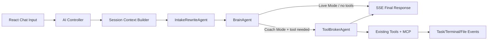
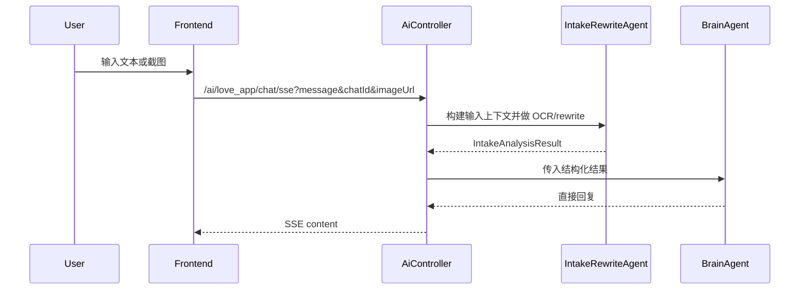
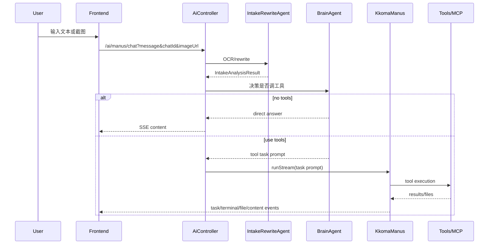

# Architecture: Lovemaster 多 Agent 恋爱陪聊 / Manus 模式

> 版本：v0.1  
> 日期：2026-03-27

## 1. 架构目标

在不推翻现有代码的前提下，为 Lovemaster 增加：

- 图片输入理解
- 三层 Agent 编排
- Love / Coach 两模式差异化路由
- 更可靠的 SSE 过程回传

核心原则：

1. 先闭环，再升级框架
2. 复用现有 `BaseAgent` / `ToolCallAgent` / `KkomaManus`
3. 把多模态输入放进 Spring AI 正常链路，而不是写旁路 HTTP 拼接
4. 把“是否调用工具”从工具层前移到大脑层

---

## 2. 现状与缺口

当前链路：

- React 前端可上传图片
- 图片经 `/api/images/upload` 落盘
- `chatApi.js` 把 `imageUrl` 加入 SSE 请求参数
- 后端聊天接口忽略 `imageUrl`
- `LoveApp` 和 `KkomaManus` 都按纯文本运行

所以真正的缺口不是“缺图片上传”，而是“缺图片到 Agent 的编排桥接”。

---

## 3. 目标架构



---

## 4. 模块划分

## 4.1 Controller 层

保留现有入口，但扩展参数与编排：

- `GET /ai/love_app/chat/sse`
- `GET /ai/manus/chat`

新增接收：

- `imageUrl`：可选

职责：

- 校验会话参数
- 解析模式
- 构建输入上下文
- 启动对应 orchestrator

## 4.2 Session Context Builder

建议新增一个轻量上下文构建层，而不是让 Controller 直接拼 prompt。

建议职责：

- 读取 `message`
- 读取 `imageUrl`
- 绑定 `chatId`
- 读取最近若干轮历史
- 产出统一 `ChatInputContext`

建议数据结构：

```java
public record ChatInputContext(
    String chatId,
    ChatMode mode,
    String userMessage,
    String imageUrl,
    List<Message> history
) {}
```

## 4.3 IntakeRewriteAgent

建议新增职责型组件，不必一开始就继承 `BaseAgent`。

推荐实现方式：

- 作为同步服务或轻量 agent service
- 输入 `ChatInputContext`
- 输出 `IntakeAnalysisResult`

建议输出结构：

```java
public record IntakeAnalysisResult(
    boolean hasImage,
    String ocrText,
    String conversationSummary,
    String rewrittenQuestion,
    List<String> uncertainties,
    String suggestedIntent,
    boolean likelyNeedTools
) {}
```

功能：

- 如果 `imageUrl == null`，只做文本 rewrite
- 如果 `imageUrl != null`，用多模态模型或 OCR 模型处理
- 输出结构化结果给 BrainAgent

## 4.4 BrainAgent

建议作为新的核心决策层。

职责：

- 读取 `ChatInputContext + IntakeAnalysisResult`
- 进行情感分析、关系判断、回复规划
- 根据模式决定是否调用工具代理

输出建议：

```java
public record BrainDecision(
    boolean callTools,
    String finalPromptForTools,
    String userFacingPrelude,
    String finalAnswerIfNoTools,
    ReplyStyle style
) {}
```

路由规则建议：

- Love 模式：默认 `callTools = false`
- Coach 模式：
  - 信息咨询、润色、解读类：`false`
  - 搜索、计划、文件生成、资料整理类：`true`

## 4.5 ToolBrokerAgent

第一阶段不重写，优先复用当前体系。

推荐做法：

- 保留 `ToolCallAgent`
- 保留 `KkomaManus`
- 新增一个薄封装，把 `BrainDecision.finalPromptForTools` 作为任务输入

也就是：

- `KkomaManus` 继续负责自主执行
- BrainAgent 负责决定何时进入它

这是当前架构最关键的分层变化。

---

## 5. 多模态接入方案

## 5.1 推荐方案

通过 Spring AI 标准多模态接口接入图片，而不是跳过 Spring AI：

- `UserMessage.media(...)`
- 或 `ChatClient.user(u -> u.text(...).media(...))`

可选数据源：

- 直接使用公网可访问的 `imageUrl`
- 或把本地文件转成 `Resource`

### 为什么优先用 Spring AI 多模态接口

- 和现有 `ChatModel` / `ChatClient` 一致
- 后续替换底层模型更容易
- 可以在同一套消息上下文里统一文本与图片输入

## 5.2 模型选择建议

第一阶段推荐两种实现路径，二选一：

### 方案 A：截图理解统一走视觉模型

- 使用 DashScope 视觉模型或 OCR 模型
- 一次完成 OCR + 语义理解

优点：

- 链路简单
- Prompt 更统一

风险：

- 模型成本与稳定性要实测

### 方案 B：OCR 与语义拆开

- 先用 `qwen-vl-ocr` 提取文本和结构
- 再把结构化结果交给文本 BrainAgent

优点：

- 输出更可控
- 容易显式展示“不确定识别项”

风险：

- 增加一次模型调用

对本项目更推荐方案 B，因为它更贴合“截图识别 Agent + 大脑 Agent”的产品定义。

---

## 6. Love 模式调用链



Love 模式不进入工具执行，除非后续版本明确开放。

---

## 7. Coach / Manus 模式调用链



---

## 8. 包结构建议

建议新增这些包，不破坏现有分层：

```text
src/main/java/org/example/springai_learn/
  ai/
    context/
      ChatInputContext.java
      IntakeAnalysisResult.java
      BrainDecision.java
      ChatMode.java
    orchestrator/
      LoveChatOrchestrator.java
      CoachChatOrchestrator.java
    service/
      IntakeRewriteService.java
      BrainDecisionService.java
      MultimodalMessageFactory.java
```

保留现有：

- `agent/`
- `app/LoveApp.java`
- `controller/AiController.java`
- `tools/`

---

## 9. 对现有类的改造建议

## 9.1 `AiController`

改造点：

- 两个接口都接收 `imageUrl`
- 不再直接只把 `message` 传给 LoveApp / KkomaManus
- 先走 orchestrator

## 9.2 `LoveApp`

建议不要继续让 `LoveApp` 承担所有模式。

可以保留：

- 普通聊天底座
- RAG 能力

但 Love 模式的新主链路建议转移到 `LoveChatOrchestrator`。

## 9.3 `KkomaManus`

保留主体逻辑，只改两点：

- 接受 BrainAgent 生成的任务 prompt
- 在首个状态消息里展示“已完成截图理解 / 问题重写”

## 9.4 SSE 事件

当前已有：

- `thinking`
- `status`
- `task_start`
- `task_progress`
- `terminal`
- `file_created`
- `content`
- `done`

建议新增：

- `intake_status`
- `ocr_result`
- `rewrite_result`

这样前端才能清楚区分“正在识别截图”和“正在执行工具”。

---

## 10. 存储与隐私

## 10.1 图片处理策略

建议：

- 原图继续由 `ImageStorageService` 管理
- Agent 推理只读取 URL 或 Resource
- 推理结束后不把完整 OCR 明文长期写入普通日志

## 10.2 历史消息

现有 `FileBasedChatMemory` 适合保存文本消息，但不适合直接保存敏感图片原始内容。

建议阶段一只持久化：

- 用户原始文本问题
- 结构化摘要
- 最终回复

避免在 chat memory 里堆完整 OCR 原文。

---

## 11. 错误处理

必须覆盖这些失败路径：

- 图片 URL 无效
- 图片读取失败
- OCR 模型超时
- OCR 结果为空
- BrainAgent 决策失败
- ToolAgent 执行失败

降级策略：

- 带图失败时，明确告知“图片未成功识别”，但仍可基于文本继续回答
- Coach 模式工具失败时，保留大脑 Agent 的直接分析结果，不让整轮会话空白结束

---

## 12. 测试策略

### 单元测试

- `IntakeRewriteService` 文本重写
- 模式路由决策
- `imageUrl` 入参校验
- 多模态消息构建

### 集成测试

- Love 模式文本输入
- Love 模式图片输入
- Coach 模式文本输入
- Coach 模式图片输入 + 直接回答
- Coach 模式图片输入 + 工具执行

### 前端联调

- 上传图片后状态展示
- OCR 失败提示
- Coach 面板事件流完整性

---

## 13. 阶段性实施建议

## Stage 1

- 打通 `imageUrl` 到后端
- 完成 IntakeRewriteService
- Love 模式先支持截图识别

## Stage 2

- 接入 BrainAgent 路由
- Coach 模式引入“先判断后执行”

## Stage 3

- SSE 事件补充
- 前端显示 OCR / rewrite 状态

## Stage 4

- 评估升级到 Spring AI Alibaba Graph / Supervisor 模式

---

## 14. 为什么这套方案适合当前仓库

因为它满足四个现实约束：

1. 不要求先升级整个 AI 框架版本
2. 不破坏现有前端页面和 Coach 面板
3. 最大化复用当前 Agent / Tool / SSE 基础设施
4. 能最快验证“截图分析 + 多 Agent 路由”是否真有用户价值
